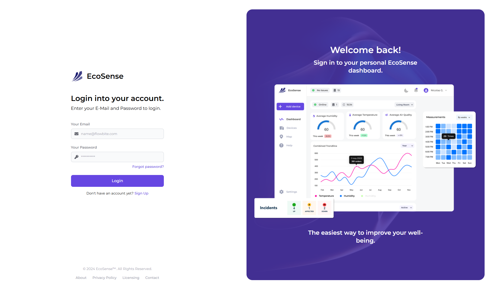
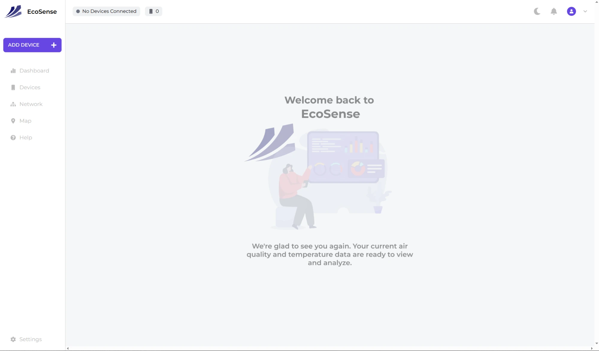
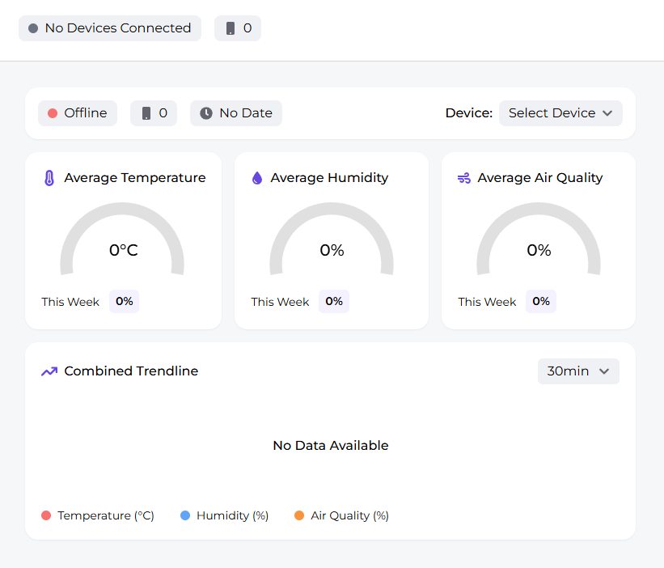
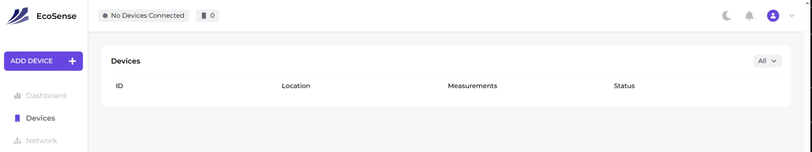

<div align="center">


# EcoSense

**Real-time indoor climate monitoring: temperature, humidity and air quality in one dashboard.**

[](https://github.com/Xylight0/EcoSense/actions/workflows/firebase-hosting-merge.yml)


[**Live Demo**](https://ecosense-7d8af.web.app) · [Features](#features) · [Getting Started](#getting-started) · [Data Model](#data-model) · [Deployment](#deployment)

<br />



</div>

## About

EcoSense is the web dashboard for a network of indoor climate sensors. Each sensor streams **temperature**, **humidity** and **air quality** readings into Cloud Firestore. Users sign in, link their sensors to their account and follow the readings live, with no page reload.

## Features

| | Feature | Description |
| :---: | --- | --- |
| 🔐 | **Authentication** | Email and password sign-up and login through Firebase Auth. All app routes are protected. |
| 📊 | **Live dashboard** | Gauges for average temperature, humidity and air quality, plus a combined trendline of the last 30 readings with series you can toggle. |
| ⚡ | **Realtime updates** | Firestore snapshot listeners push new readings to the UI the moment they arrive. |
| 📟 | **Device management** | Link sensors by ID and see each one's measurement count and online/offline status. |
| 🟢 | **System status** | The top bar summarises your fleet as *System Running*, *System Issues* or *System Offline*. |
| 🚀 | **CI/CD** | GitHub Actions deploys to Firebase Hosting on every push to `main` and creates preview channels for pull requests. |

## Screenshots

<table>
  <tr>
    <td width="50%"></td>
    <td width="50%"></td>
  </tr>
  <tr>
    <td align="center"><sub><b>Home</b>: welcome screen after login</sub></td>
    <td align="center"><sub><b>Dashboard</b>: gauges and combined trendline per device</sub></td>
  </tr>
  <tr>
    <td colspan="2"></td>
  </tr>
  <tr>
    <td colspan="2" align="center"><sub><b>Devices</b>: all linked sensors with their status</sub></td>
  </tr>
</table>

## Tech Stack

| Layer | Technology |
| --- | --- |
| Frontend | React 18, React Router 6, Vite 5 |
| Styling | Tailwind CSS, Montserrat |
| Charts | MUI X Charts (Gauge, LineChart) |
| Backend | Firebase Authentication, Cloud Firestore |
| Hosting | Firebase Hosting with GitHub Actions |

## Getting Started

### Prerequisites

- [Node.js](https://nodejs.org/) 18 or newer
- A [Firebase](https://console.firebase.google.com/) project with **Authentication** (Email/Password provider) and **Cloud Firestore** enabled

### Installation

```bash
git clone https://github.com/Xylight0/EcoSense.git
cd EcoSense
npm install
```

### Configuration

Copy `.env.example` to `.env`. Fill it in with the values from **Firebase Console → Project settings → Your apps → SDK setup and configuration**:

```env
VITE_API_KEY=
VITE_AUTH_DOMAIN=
VITE_PROJECT_ID=
VITE_STORAGE_BUCKET=
VITE_MESSAGING_SENDER_ID=
VITE_APP_ID=
VITE_MEASUREMENT_ID=
```

### Run

```bash
npm run dev
```

The app is now running at `http://localhost:5173`.

### Available Scripts

| Command | Description |
| --- | --- |
| `npm run dev` | Start the development server |
| `npm run build` | Build for production into `dist/` |
| `npm run preview` | Serve the production build locally |
| `npm run lint` | Lint the codebase with ESLint |

## Usage

1. **Create an account** at *Sign Up*.
2. **Add a device**: click **Add Device** in the sidebar and enter your sensor's ID.
3. **Monitor**: open **Dashboard** and pick the sensor from the **Device** dropdown.
4. **Check health**: the **Devices** page shows which sensors are online.

## Data Model

EcoSense uses two Firestore collections:

```text
users/{uid}
├── firstName, lastName, email
├── role: "owner"
├── createdAt: Timestamp
└── devices: ["<deviceId>", ...]

devices/{deviceId}
├── temperature: [{ data: "21.5", time: <unix seconds> }, ...]
├── humidity:    [{ data: "48",   time: <unix seconds> }, ...]
└── air_qual:    [{ data: "80",   time: <unix seconds> }, ...]
```

Sensors append a reading to each array about once a minute. A device counts as **online** when its latest reading is less than about 70 seconds old.

## Project Structure

```text
src/
├── api/            # Firestore helpers (one-off reads and realtime listeners)
├── assets/         # Logo, illustrations, preview images
├── components/     # Sidebar and top bar
├── hooks/          # Reusable React hooks
├── routes/         # Pages: login, registration, dashboard, devices, ...
├── AuthConext.jsx  # Auth state provider
├── firebase.js     # Firebase initialisation
└── main.jsx        # Router and app entry point
```

## Deployment

The app is hosted on **Firebase Hosting**. Two workflows in [`.github/workflows`](.github/workflows) handle deployment:

- **Push to `main`**: build, then deploy to the live channel
- **Pull request**: build, then deploy to a preview channel

Both workflows read the `VITE_*` variables and `FIREBASE_SERVICE_ACCOUNT_ECOSENSE_7D8AF` from the repository secrets.

To deploy by hand:

```bash
npm run build
firebase deploy
```

